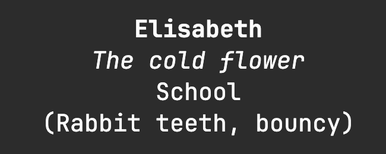

**To learn a name (tldr)**
1. Learn how to pronounce the name
2. Learn how to spell the name
3. Practice the name
4. Create a title based on interaction, something you noticed, etc.
5. Write everything down *after* the interaction
6. Create Anki flashcards
7. Review flashcards

Ever told someone "*I'm really bad with names*" "*Sorry, what was your name again?*", "*I just can't remember a name*". Well so did I, until I got fed up with never remembering peoples names. Especially since I want to be a teacher. And the biggest hurdle of all, was avoiding having pictures of everyone I waanted to remember the name of. It'd be quite a hurdle to ask for a photo of every child, just so that I can remember their names. So here's how I go about it.

## Initial Steps for Learning a name

*[ Learn the name -> spaced reppetition -> write down / recap -> Use and practice ]*

In the inital steps for learning a persons name, we have to gather key information to ensure that we'll remember it. We need to know the name, how to pronounce it and how to spell it.
It's especially important to learn how to spell the name when we are dealing with names that have variations: Sara/Sarah, Steven/Stephen, Jeff/Geoff. A persons name is their identity and treasure. Spelling it incorrectly, is worse than forgetting it. If you've ever met somone called *Anna* or *Maria*, and pronounced it with an "*e*" at the end instead, you migth have experineced the type of reaction it can give. Now that we've acquired the name, spelling and pronounciation, it is time for spaced repetition.

Wait about 2 minutes, look at the person, and then we check if we remember their name. If not, immediatly ask for their name again. If succesfully rememberd, wait about 5-10 min and check again. Next, focus on putting the name to use and practicing when there's a little down time in the interaction. Once we are no longer with the people who's names we are trying to remember, do a mental recap of the interactions we've had, and the names of the people we've met. This is a great time to write down the names for use with Anki.

### In it for the long Haul

*[ Ronald Johnson's Anki method to remembering names | No need for pictures ]*

> "*To engage with a book's ideas over time, readers must remember its details, and that's already a challenge[1]. One promising solution lies in spaced repetition memory systems[2], which allow users to retain large quantities of knowledge reliably and effciently.*"(Matuschak & Nielsen, 2020, p. 63)  

[Anki](https://apps.ankiweb.net/) is a great piece of software for memorisation, with it's spaced repetition flashcards. And when we hear flashcards and remembering names we think "*Shit… now I have to take pictures of people, or find pictures of people for my flashcards*". Luckily, this methode has no need for pictures.

This methode is based off of *Ronald Johnson's* article [How to Remember Names](https://thecraftofmemory.substack.com/p/how-to-remember-names) (johnson2024). In it, he explains that a flashcards front includes the name and inside square brackets [], key information, such as connections or traits. The back of the card can be empty or hold extra information. Tags are used for the location where the name was learned, giving us the ability to review names before we return to the place where we first met them. In my setup, I forego tags and keep everything in one deck, and I prefer to write the location in the card.
(*I can highly reccommend that you read his article if you are new to Anki and want a view on the mentality needed for remembering names*)

When reviewing our flashcards, we are to imagine the face of the person as vividly as possible, And if we deem it a success, we pass. If we can't visualize the face, we mark the card and suspend it, until we meet the person again, whereupon we can unsuspend and continue using the card.

## Experience and Improvements to the Methode

[ *Physicial and personality traits aren't unique enough | Nicknames are easier than real names* ]

I started running in to some hiccups with the methode. I began work as a helper in a kindergarten, and tried to remember about 20-50 names all at once, some of them with the identical names. finding a unique connection, physical and personality trait, proved difficult to do, on a short amount of time. The kids were young and hadn't developed easy to see traits (for me at least). On top of it, I was working irregular hours/days. The flashcards I made often ended with me forgetting who it was.

Fast forward in time, and I switched job as a substitute teacher. Irregular hours and classes. I started out with the usual flashcards: Names, traits, location. At some point I wrote down a funny little title for one of the students: "*Plant Santa*". During our first interaction, this child had run up to me during recess, and given me a plant they had pulled out of the ground. I thought it unique enough to add to the flashcard. Then I tried adding more nicknames to the flashcards, and started noticing that it became easier to remember who they were.

These nicknames or "*titles*" as i like to call them, was a turning point in my ability to remember names. A silly title based on an interaction or observation of the person. "Paper Swordsman", "The Cold Flower", "Silent Sun", "Golden Ear Drops", "Brain Rot Printer", just to mention a few. These are leagues more unique and indetifying than "girl with glasses", "big nose", "round face", "small eyes", "likes chocolate".

The benefits of a title, is that it helps cut down the amount of time used reading a flashcard, trying to identify which of the 34. Thomas's we talking about? Especially since this is done without pictures.
A title doesn't need to be based on something amazing. "The Cold Flower", is from a child being outside while it's still chilly, wanting to show off her dress with a bunch of flowers on it. All it needs to be is unique to them.

### The Flascard

[ *Name -> Title -> Location -> Physical/Personality trait* ]

My flashcards are structured as follow: Name -> Title -> Location -> physical / Personality trait. From top to bottom is sorted by most important information to least, for remembering the name. Often times, the title is enough, and the location can help quickly jog the memory. The traits at the bottom, are used when I found it difficult to remember who this is and need a lttle extra help.  

### Current Shortcomings of This Methode

*[ Inconsistent reviews leads to forgetting names ]*

There are no pictures. Therefore, if we forget the face that is associated with the name, we'll have to suspend the card, and take a mental note of finding out who this is the next time we visit the location. Therefore, missing out on reviewing the names in Anki, has a much higher impact.

It can also take quite a bit of time out of ones day, having to write down 20+ names at once, and make titles for them all.

### Conclusion

Titles are a powerful way of creating a unique identifier for each person that we meet and want to remember. No word association, funny animal based on the first letter in their name, or basic traits. For remembering through Anki, the most important is being honest about our ability to imagine the face of the person in question and reviewing the cards on a consistent basis. This is a methode that isn't finished. Over time I'll keep reviewing it and making changes to it, with the focus that no picture is needed to remeber a name. I'll keep making updates as the methode progresses.

Good luck remembering.

– Martin MacAlpine

***

## Bibliography

Matuschak, A., & Nielsen, M. (2020). Timeful Texts. I: F. Hegland (Red.), *The Future of Text* (Second printing with minor corrections 2021, s. 62–65). Future Text Publishing.

Johnson, R. (2024, 1. januar). How to Remember Names [Substack newsletter]. *The Craft of Memory*. [https://thecraftofmemory.substack.com/p/how-to-remember-names](https://thecraftofmemory.substack.com/p/how-to-remember-names)
